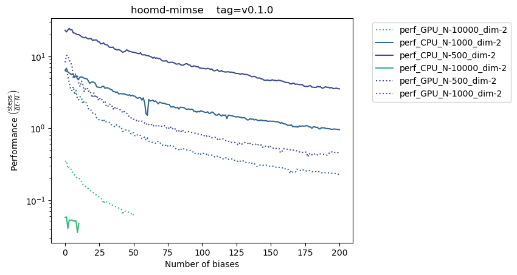
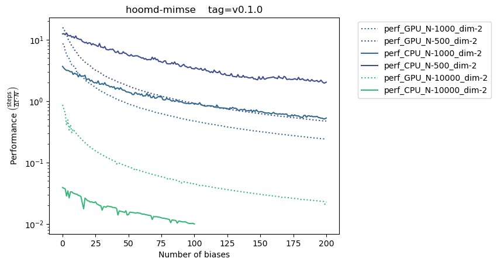

# Benchmarks

This code is repurposed from the `hoomd-benchmarks` repo.

``` bash
python3 -m benchmarks.mimse_lj --device GPU -N 1000 --dim 2 --n_biases=50 -v
python3 -m benchmarks.mimse_lj --device GPU -N 10000 --dim 2 --n_biases=50 -v
python3 -m benchmarks.mimse_lj --device CPU -N 1000 --dim 2 --n_biases=10 -v
python3 -m benchmarks.mimse_lj --device CPU -N 10000 --dim 2 --n_biases=10 -v

```

## State of benchmarks

Using an Intel 12700 and RTX 3060Ti, we find a moderate speedup once we surpass ~1,000 particles. These benchmarks are compiled in (mostly) 64-bit precision mode, so the 3060Ti suffers a bit there. Though otherwise, there are a handful of opportunities to improve performance further.

### 12700 + 3060Ti



### Titan V

